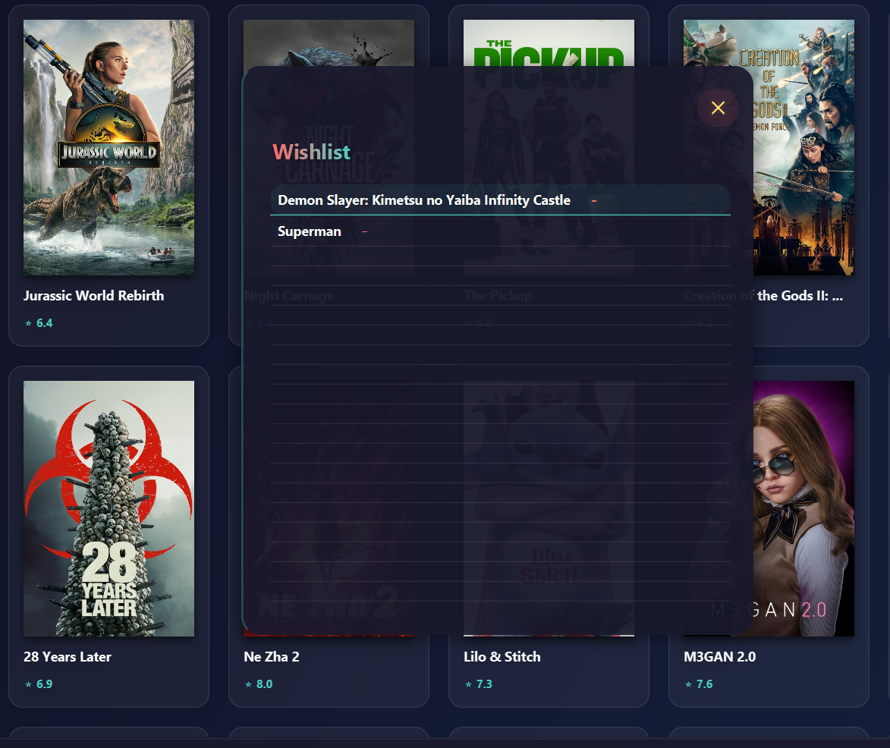
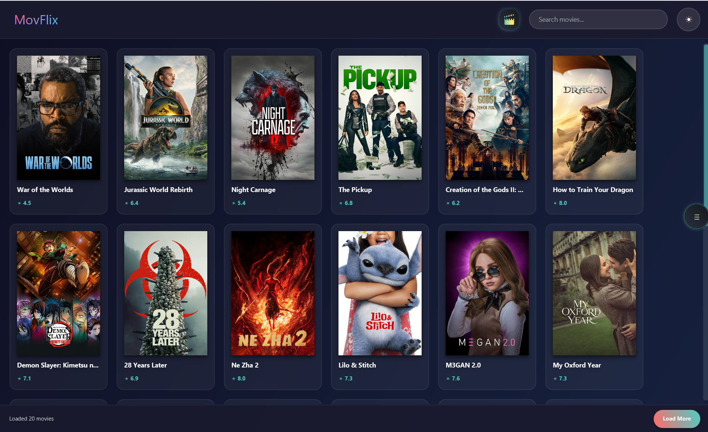

# Movie Browser App - MovFlix 🎬  

A **JavaFX-based** movie browser application that fetches data from **TMDB API** and stores favorites in **MongoDB**.  

---

## 📸 Screenshots  

| Wishlist | Movie Browser |  
|----------|--------------|  
|  |  |  

---

## ✨ Features  
- 🔍 **Search movies** using TMDB API.  
- ❤️ **Save favorites** to a wishlist (stored in MongoDB).  
- 📊 View **ratings and details**.  
- 🎨 **Sleek JavaFX UI** with responsive design.  

---

## 🛠️ Technologies Used  
- **Frontend**: JavaFX  
- **Backend**: MongoDB (for wishlist storage)  
- **API**: [The Movie Database (TMDB)](https://www.themoviedb.org/)  

---

## 🚀 Setup & Run  

### Prerequisites  
- Java **17+**  
- MongoDB (local or cloud)  
- TMDB API key (**store securely** in environment variables)  

### Steps  
1. **Clone the repo**:  
   ```sh
   git clone https://github.com/yourusername/movflux.git
   cd movflix
   ```

2. **Configure environment variables**:  
   Create a `.env` file (or set in IDE):  
   ```sh
   TMDB_API_KEY=your_api_key_here
   ```

3. **Run the app**:  
   ```sh
   ./gradlew run   # For Gradle
   # or
   mvn javafx:run  # For Maven
   ```

---

## 📂 Project Structure  
```
movflix/  
├── src/  
│   ├── main/java/lab/visual/movieapp  
│   │   ├── controller/    # JavaFX controllers  
│   │   ├── model/        # Data classes (Movie, User)  
│   │   ├── service/      # TMDB API & MongoDB logic
│   │   ├── utils/
│   │   └── Main.java       # Main class  
│   └── resources/         # FXML, CSS, images
│   │   ├── css/
│   │   ├── images/
│   │   └── lab/visual/movieapp
│   │   |   ├── main.fxml
│   │   |   └── movieDetail.fxml
├── .env.example           # Template for environment vars  
└── README.md  
```

---

## 🔧 Troubleshooting  
- **"API key not found"**: Ensure `.env` is set or variables are passed in IDE.  
- **MongoDB connection issues**: Check if the server is running (`mongod`).  

---

## 📜 License  
MIT  

---

🌟 **Happy browsing!** Contribute by opening issues or PRs. 🍿  

--- 

*(Images above show the wishlist and movie search functionality.)*
